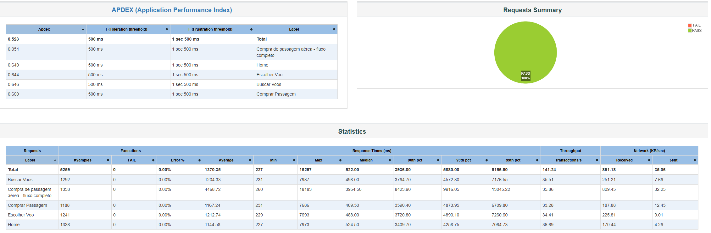
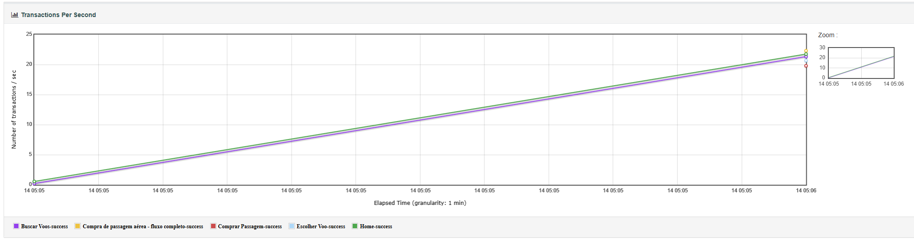
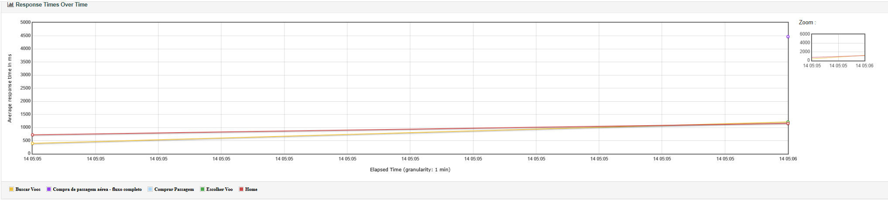
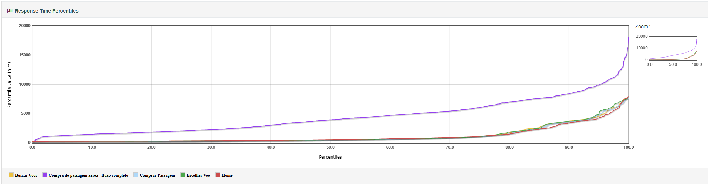
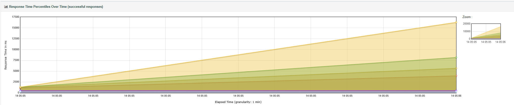

# 🚀 Teste de Performance - BlazeDemo

## 📌 Objetivo

Este projeto tem como objetivo validar o desempenho da aplicação **https://www.blazedemo.com**, simulando o cenário de **compra de passagem aérea com sucesso**, sob diferentes níveis de carga.

---

## 🧪 Cenário testado

Fluxo completo de compra de passagem:

1. Acesso à página inicial
2. Busca de voos
3. Seleção de voo
4. Preenchimento de dados
5. Confirmação da compra

O fluxo foi encapsulado utilizando um **Transaction Controller com Generate Parent Sample**, permitindo medir o tempo total da transação de ponta a ponta.

---

## 🛠️ Ferramentas utilizadas

* Apache JMeter 5.6.3
* Java 21

---

## 📂 Estrutura do projeto

```
qa-performance-jmeter/
├── blazedemo-performance.jmx
├── resultado.jtl
├── dashboard/
├── images/
│   ├── overview.png
│   ├── throughput.png
│   ├── percentiles.png
│   ├── response-times.png
│   └── response-times-percentiles-over-time.png
└── README.md
```

---

## ▶️ Como executar o teste

### 🔹 Execução via interface (GUI)

1. Abrir o JMeter
2. Carregar o arquivo `blazedemo-performance.jmx`
3. Executar o teste

---

### 🔹 Execução via linha de comando

```bash
jmeter -n -t blazedemo-performance.jmx -l resultado.jtl -e -o dashboard
```

---

### 📊 Visualizar relatório

Abrir o arquivo:

```
dashboard/index.html
```

---

## 🎯 Critério de aceitação

* **250 requisições por segundo**
* **Tempo de resposta p90 inferior a 2 segundos**

---

## 📈 Estratégia de testes

Foram definidos dois tipos de testes:

### 🔹 Teste de Carga

Avalia comportamento sob aumento progressivo de usuários.

| Threads | Ramp-Up | Duração |
| ------- | ------- | ------- |
| 50      | 10s     | 60s     |
| 100     | 20s     | 60s     |
| 200     | 30s     | 60s     |

---

### 🔹 Teste de Pico

Avalia comportamento sob subida rápida de carga.

| Threads | Ramp-Up | Duração |
| ------- | ------- | ------- |
| 200     | 5s      | 30s     |

---

## 📊 Resultados

### 🔹 Teste de Carga

| Cenário      | Throughput | p90     | Erro |
| ------------ | ---------- | ------- | ---- |
| 50 usuários  | 10.5 req/s | 2421 ms | 0%   |
| 100 usuários | 11.4 req/s | 2444 ms | 0%   |
| 200 usuários | 12.0 req/s | 2976 ms | 0%   |

---

### 🔹 Teste de Pico

| Cenário                       | Throughput | p90     | Erro |
| ----------------------------- | ---------- | ------- | ---- |
| 200 usuários (ramp-up rápido) | 11.5 req/s | 3395 ms | 0%   |

---

## 🧠 Análise dos resultados

Os testes demonstraram que:

* O sistema apresentou **baixo throughput (~10–12 req/s)**, muito abaixo do esperado.
* O **tempo de resposta (p90)** ultrapassou o limite de 2 segundos em todos os cenários.
* O aumento da carga **não resultou em crescimento proporcional do throughput**, indicando **limitação de escalabilidade**.
* O sistema manteve **0% de erro**, demonstrando estabilidade funcional, porém com limitação de capacidade.

---

## ❌ Conclusão

O sistema **não atende ao critério de aceitação proposto**:

* ❌ Throughput muito abaixo de 250 req/s
* ❌ p90 acima de 2 segundos

---

## 💡 Considerações finais

Os testes indicam possíveis gargalos de desempenho, como:

* Limitação de processamento
* Arquitetura não escalável
* Operações síncronas sob alta carga

Apesar da estabilidade funcional, o sistema não é capaz de suportar alta concorrência.

---

## 📊 Evidências do teste

### 🔹 Visão geral do teste



---

### 🔹 Throughput (requisições por segundo)



---

### 🔹 Tempo de resposta ao longo do tempo



---

### 🔹 Percentis de tempo de resposta



---

### 🔹 Evolução dos percentis ao longo do tempo



---

💡 Os gráficos evidenciam claramente a limitação de throughput e o aumento do tempo de resposta sob carga, confirmando a incapacidade do sistema de escalar.

---

## 🚀 Autor

Edson Boaro
QA Sênior | Automação | Performance Testing