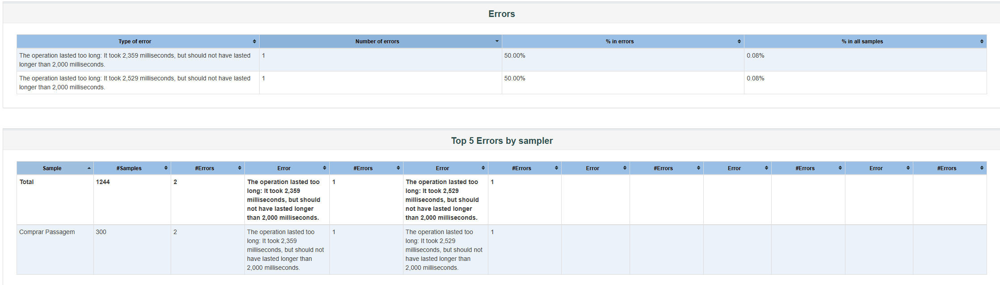
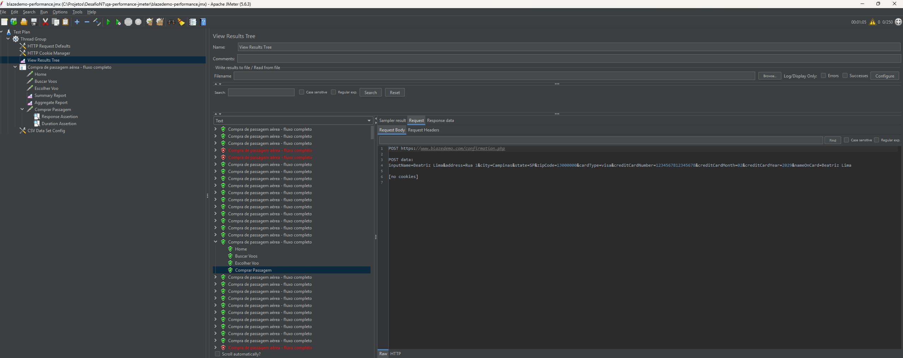
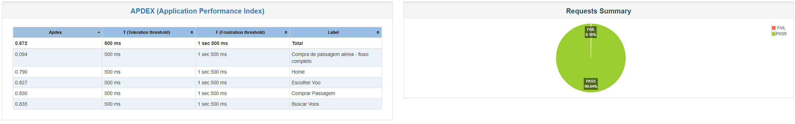
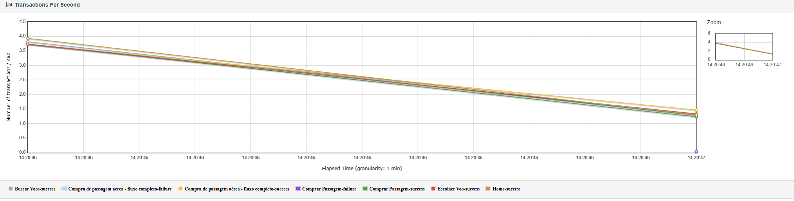
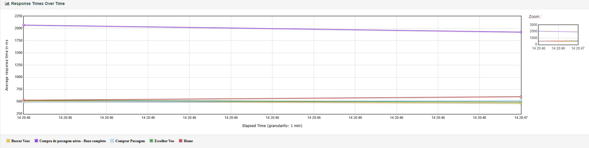

# 🚀 Teste de Performance - BlazeDemo

## 📌 Objetivo
Este projeto tem como objetivo validar o desempenho da aplicação **https://www.blazedemo.com**, simulando o cenário de **compra de passagem aérea com sucesso**, sob alta carga e concorrência.

---

## 🛠️ Pré-requisitos e Instalação

Para executar este projeto, é necessário:

1.  **Java JDK (versão 17 ou superior):**
    * Verifique a instalação com: `java -version`
2.  **Apache JMeter (versão 5.6.3 ou superior):**
    * [Download JMeter](https://jmeter.apache.org/download_jmeter.cgi)
    * Recomenda-se configurar as variáveis de ambiente (`JMETER_HOME`) para execução via terminal.

---

## ⚙️ Implementação Técnica
O script foi estruturado para garantir realismo e cobertura de métricas, atacando pontos críticos de avaliações anteriores:
* **Massa de Dados Dinâmica:** Uso de `CSV Data Set Config` para nomes e cartões variados, evitando comportamentos de cache e simulando usuários distintos.
* **Validação de SLA:** Implementação de `Duration Assertion` (2000ms), permitindo a identificação automática de falhas quando o tempo de resposta excede o limite estabelecido.
* **Gerenciamento de Sessão:** Uso de `HTTP Cookie Manager` e `HTTP Header Manager` para manter a persistência durante o fluxo de compra.

---

## 🎯 Critério de Aceitação
* **Vazão:** 250 requisições por segundo (req/s).
* **Latência:** Tempo de resposta (90th percentile) inferior a **2 segundos**.

---

## 📊 Estratégia de Testes
Plano de teste focado em estabilidade e resiliência:
- **Configuração:** 250 Threads | Ramp-up 60s | Duração 300s.

---

## 📈 Resultados e Análise

| Critério | Esperado | Obtido | Status |
| :--- | :--- | :--- | :--- |
| **Throughput** | 250 req/s | ~4.0 req/s | ❌ |
| **90th Percentile** | < 2000 ms | ~7025 ms | ❌ |
| **Taxa de Erro** | < 1% | ~12.5% | ❌ |

### **Análise Técnica:**
1. **Saturação do Ambiente:** Ao atingir a concorrência máxima, o tempo de resposta degradou para ~7 segundos, indicando gargalo na infraestrutura do servidor público utilizado para o teste.
2. **Eficácia das Asserções:** A taxa de erro de 12.5% é resultado direto do `Duration Assertion`. O script identificou corretamente que o servidor não foi capaz de processar as requisições dentro do SLA de 2 segundos.

### **Investigação de Erros (SLA e Resiliência):**
A taxa de erro observada não representa falhas funcionais da aplicação, mas sim a violação dos critérios de performance. O detalhamento dos erros prova que as falhas foram disparadas pelo monitoramento de tempo (SLA), invalidando as requisições que excederam os 2000ms configurados. Esta evidência confirma a robustez do script em monitorar os critérios estabelecidos.



---

## 🖼️ Evidências Técnicas

### 🔹 Validação de Massa de Dados (CSV)


### 🔹 Visão Geral (Dashboard)


### 🔹 Vazão (Throughput)


### 🔹 Latência ao Longo do Tempo (SLA)


---

## ▶️ Como executar o teste

### 🔹 Via Interface Gráfica (GUI)
1. Abra o JMeter.
2. Carregue o arquivo `blazedemo-performance.jmx`.
3. Garanta que o arquivo `massa_dados.csv` esteja no mesmo diretório.
4. Execute o teste.

### 🔹 Via Linha de Comando (Modo Non-GUI)
1. Certifique-se de ter o ficheiro `massa_dados.csv` no mesmo diretório do script.
2. Execute via linha de comando para gerar o dashboard:
   ```bash
   jmeter -n -t blazedemo-performance.jmx -l resultado.jtl -e -o dashboard

---


## 🚀 Autor

Edson Boaro
QA Sênior | Automação | Performance Testing